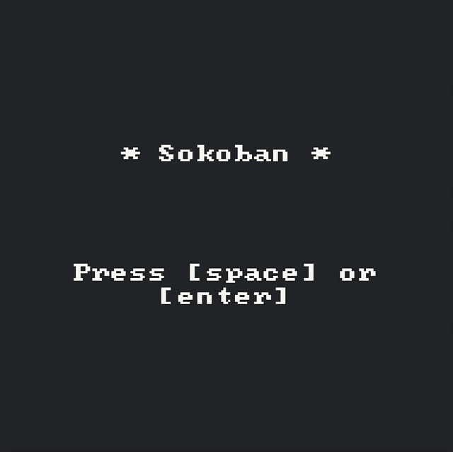

# Sokoban

A small proof of concept writing a game using [Odyc.js](https://odyc.dev/).

## Roadmap

- [ ] Bug: When user move a box from target, we need to recreate target.
- [ ] Feature: Menu logic to choice levels.
- [ ] Feature: Menu logic to restart game level.
- [ ] Feature: More levels.
- [ ] Feature: Create a way to identify when user is blocked.
- [ ] Refactor: Create a better color palette and pixel art's.
